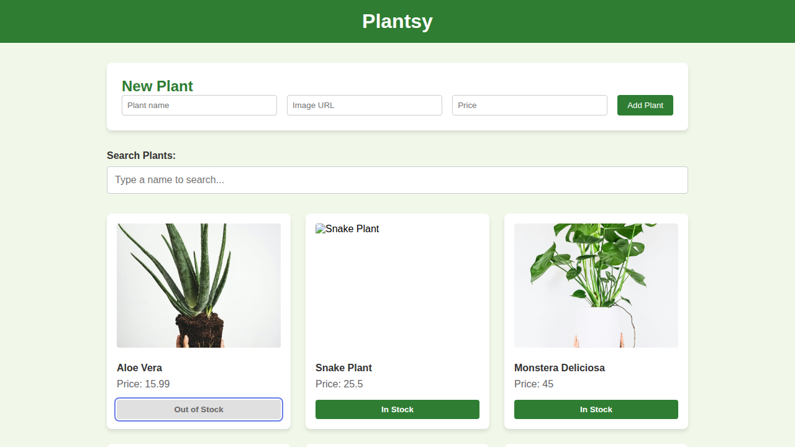

# Plantsy

Plantsy is a modern, responsive web application for managing your personal plant collection. Users can view a list of plants, add new plants to their collection, search for plants by name, and track stock status.



## Features

- **View Plants** - See all your plants in a beautiful grid layout.
- **Add New Plants** - Add plants by providing a name, image URL, and price.
- **Stock Management** - Toggle between "In Stock" and "Out of Stock" with a single click.
- **Search** - Quickly find specific plants in your collection using the real-time search bar.
- **Persistent Data** - All data is stored and retrieved from a backend server.

## Technology Stack

- **React** - UI library for building a dynamic user interface.
- **Vite** - High-performance build tool and development server.
- **JSON Server** - Mock REST API for data persistence.
- **Vitest & React Testing Library** - Modern testing suite for ensuring code quality.
- **CSS3** - Custom styling with a focus on responsiveness and aesthetics.

## Getting Started

### Prerequisites

- Node.js (v18 or higher)
- npm

### Installation

1. Clone the repository:
   ```bash
   git clone <repository-url>
   cd plantsy
   ```

2. Install dependencies:
   ```bash
   npm install
   ```

### Running the Application

This application requires both the frontend and backend to be running.

1. **Start the Backend Server:**
   ```bash
   npm run server
   ```
   The backend will be available at `http://localhost:6001`.

2. **Start the Frontend Development Server:**
   ```bash
   npm run dev
   ```
   The application will be available at `http://localhost:5173`.

### Running Tests

To run the test suite:
```bash
npm run test
```

## Project Structure

- `src/components/` - React components (NewPlantForm, PlantCard, PlantList, Search).
- `src/App.jsx` - Main application container and logic.
- `db.json` - Backend database file.
- `src/tests/` - Unit and integration tests.

## Contributing

1. Create a feature branch.
2. Implement your changes.
3. Ensure all tests pass.
4. Open a Pull Request.
